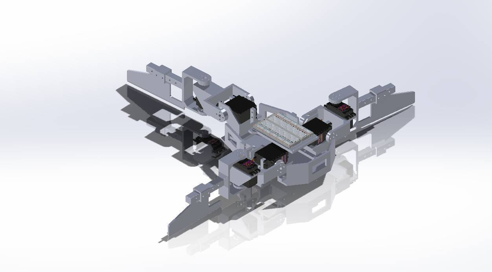
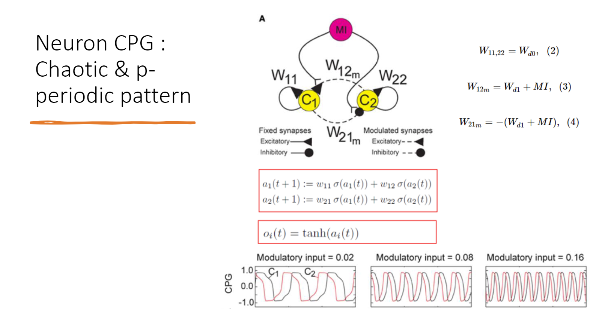

# Mudskipper_Robot
  หุ่นยนต์จำลองการเคลื่อนที่ของปลาตีน โดยจำลองตัวปลาตีน ครีบอก หาง 

## Mudskipper Robot Model
  การใช้งาน ในโฟลเดอร์ Mudskipper_Solid2022 มีไฟล์ Part และไฟล์ Assembly ซึ่งเป็น Model 3D ของตัวหุ่นยนต์ ไฟล์ให้งานกับ SolidWork ver.2022
  

## Programing 
  ในโฟลเดอร์ Mudskipper_code มีไฟล์โปรแกรมการใช้งานหุ่นยนต์ โดยรวมโปรแกรมนี้ ใช้สมการ central pattern generators ในการสั่งงาน Servomoter ดังนั้นให้ศึกษา central pattern generators ก่อนทำความเข้าใจ code และใช้งาน code
  ### central pattern generators
  ประสาทชีวภาพที่จัดระเบียบตัวเองวงจรที่สร้างจังหวะเอาต์พุตในกรณีที่ไม่มีจังหวะป้อนข้อมูล. เป็นที่มาของรูปแบบของเส้นประสาทที่เชื่อมต่อกัน
 ที่ขับเคลื่อนจังหวะและพฤติกรรมของมอเตอร์ตายตัว
  
